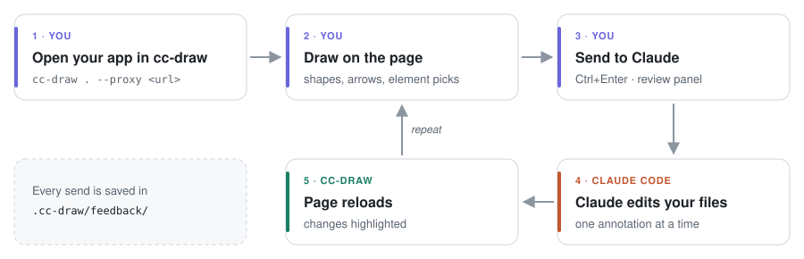

# cc-draw

Draw on top of your frontend with **the real Excalidraw** and have **Claude Code** apply it.

<picture>
  <source media="(prefers-color-scheme: dark)" srcset="docs/flow-dark.svg">
  
</picture>

## Install

```bash
npm install     # also builds the Excalidraw layer (dist/canvas)
npm link        # makes the `cc-draw` command available globally (optional)
```

Requires [Claude Code](https://claude.com/claude-code) installed and logged in (`claude` on your PATH) and Node 22+.
If you change anything in `src/canvas/`, run `npm run build`.

## Usage

**Static site** (plain HTML/CSS/JS):

```bash
cc-draw ./my-site
```

**Project with a dev server** (Vite, Next, Astro…): run your dev server and put cc-draw in front of it:

```bash
npm run dev                                   # e.g. http://localhost:5173
cc-draw . --proxy http://localhost:5173   # opens http://localhost:4545
```

HMR keeps working. To try it out: `npm run example` (static) or `cd playground && npm run dev` + `npm run design` (React).

## In the browser

`Alt+Shift+D` or the **Annotate** button toggles drawing mode. The toolbar is Excalidraw's own (same shortcuts: `R` rectangle, `D` diamond, `O` ellipse, `A` arrow, `L` line, `P` pen, `T` text, `E` eraser, `Q` lock tool), plus:

- **Select page element (`W`)** — like the DevTools element picker: hover and the page element lights up; click and it becomes an annotation tied to exactly that element. Hold `Shift` to pick several.
- **Hand = interact with the page (`H`)** — drawings stay visible, but clicks, forms and scrolling go to the real page (open a menu, switch a tab, fill a field before annotating). Click a tool in the toolbar to go back to drawing.

The side panel only shows the color. We stripped the rest of Excalidraw (frames, embeds, laser, Mermaid, command palette, menu).

**Comments**: every drawing gets a number. When you finish a drawing (or click its number) a "What do you want here?" field opens — that's the main instruction for that annotation. Numbers with a comment show it on hover.

**Sending**: the **Send to Claude** button (or `Ctrl+Enter`) opens the review panel: the list of converted annotations (you can edit comments there), general instructions and **Send**. `Esc` leaves drawing mode.

## How the "conversion" works

Every drawing becomes a numbered annotation with:

- **The target DOM element**: an element picked with `W` is exact; rectangle/diamond/ellipse/loop picks the best-fitting element (or lists the ones enclosed); an underline picks the text above it; an arrow records source and destination (including "points to annotation #N" when it connects two drawings). It also includes the CSS selector, an HTML snippet, computed styles and, for React/Vue/Svelte in dev mode, the likely source file.
- **The comment** (main instruction) and any **text** written near or inside the drawing.
- **Two images**: the page area as it is, and the same area with the drawings, numbers and comments on top.

All of it goes to `claude -p` running in the project folder, with permission to edit files (`acceptEdits`). Progress shows up in a panel on the page, and the page updates on its own at the end. Later sends continue the same conversation (you can uncheck that).

Each send is stored in `.cc-draw/feedback/<date>/` (`prompt.md`, `feedback.json`, images) and the latest prompt in `.cc-draw/latest.md`. To use your interactive Claude Code session instead of headless mode: run with `--dry-run` and tell Claude *"apply the feedback in .cc-draw/latest.md"*.

## Options

```
-p, --port <n>             port (default 4545)
    --proxy <url>          dev server URL
-m, --model <model>        Claude model (e.g. opus, sonnet)
    --permission-mode <m>  default acceptEdits; use bypassPermissions if Claude needs to run commands
    --no-open              don't open the browser
    --dry-run              only generate the prompt, don't call Claude
```

## Layout

- `src/server.js` — static server/proxy, injects the overlay, receives feedback, runs Claude
- `src/overlay/overlay.js` — page side: Excalidraw iframe, scroll sync, element picker, comments, drawing → DOM conversion, capture
- `src/canvas/` — the Excalidraw app (React) running in the iframe; `scripts/build-canvas.mjs` builds it into `dist/canvas`
- `src/prompt.js`, `src/claude.js` — prompt building and `claude -p` execution
